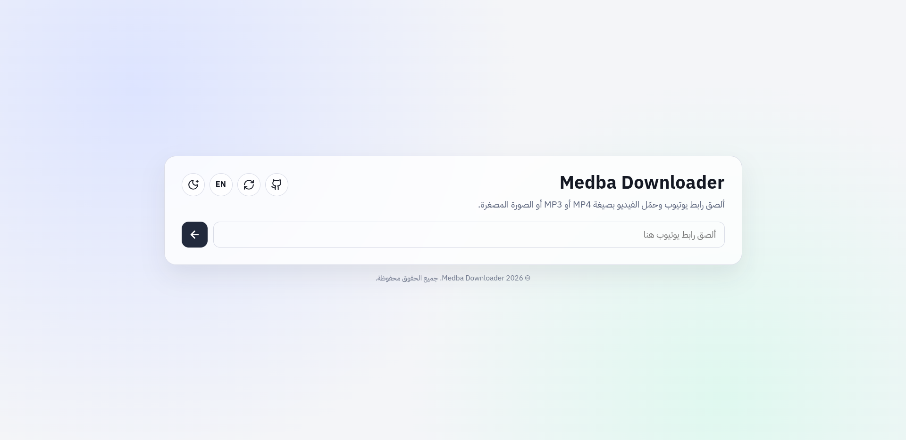
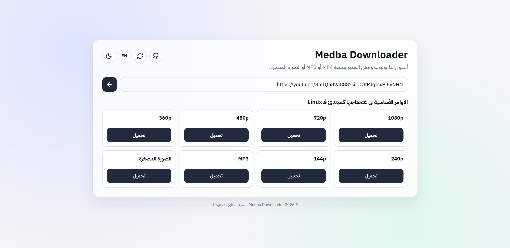

# Medba Downloader

Minimalist YouTube downloader web app.
Paste a YouTube URL, pick a quality, download MP4/MP3/thumbnail, and leave.
No accounts, no database, no dashboard.

## Screenshots

### Light Mode



### Dark Mode


### Format Selection



### English Support


## Features

- Single-page UI
- Download MP4 qualities with audio
- Download MP3
- Download original thumbnail
- English/Arabic language toggle
- Light/Dark theme toggle
- Friendly and readable error messages
- Temporary file cleanup after streaming download

## Tech Stack

- Frontend:  
- Backend:  
- Download engine: 
- Media processing: 

## Project Structure

```text
medba-downloader/
├── client/
│   ├── public/
│   │   └── assets/
│   │       └── favicon.png
│   ├── src/
│   │   ├── App.jsx
│   │   ├── index.css
│   │   └── main.jsx
│   ├── index.html
│   ├── package.json
│   └── vite.config.js
├── server/
│   ├── routes/
│   │   ├── download.js
│   │   └── formats.js
│   ├── tmp/
│   ├── package.json
│   └── server.js
├── .env.example
└── README.md
```

## Requirements


Built and tested on: 

## Setup by OS

### Linux (general)

Install `ffmpeg`, `python3`, and `pip` with your distro package manager, then install `yt-dlp` with pip.

Examples:

 

```bash
sudo apt update
sudo apt install -y ffmpeg python3-pip
python3 -m pip install yt-dlp
```


```bash
sudo dnf install ffmpeg python3-pip
python3 -m pip install yt-dlp
```


```bash
sudo pacman -S ffmpeg python-pip
python -m pip install yt-dlp
```


Install dependencies with `winget`:

```powershell
winget install --id Gyan.FFmpeg -e
winget install --id Python.Python.3.12 -e
py -m pip install yt-dlp
```

Then restart terminal so `ffmpeg` and `yt-dlp` are available in `PATH`.

## Quick Start

### 1) Install dependencies

```bash
cd server && npm install
cd ../client && npm install
```

### 2) Configure environment

Create backend env file:

```bash
cd server
cp ../.env.example .env
```

PowerShell alternative:

```powershell
cd server
Copy-Item ..\.env.example .env
```

Optional client env (`client/.env`):

```env
VITE_API_URL=http://localhost:5000
VITE_GITHUB_URL=https://github.com/med6ba/medba-downloader
```

### 3) Run the app

From the project root, run:

```bash
npm run dev
```

Open: `http://localhost:5173`

## Environment Variables

From `.env.example`:

```env
PORT=5000
CLIENT_ORIGIN=http://localhost:5173
RATE_LIMIT_WINDOW_MS=60000
RATE_LIMIT_MAX=120
YTDLP_TIMEOUT_MS=120000
REMOTE_FETCH_TIMEOUT_MS=15000
VITE_API_URL=http://localhost:5000
```

Notes:

- `PORT` and `CLIENT_ORIGIN` are used by the backend.
- `RATE_LIMIT_WINDOW_MS` and `RATE_LIMIT_MAX` control API rate limiting.
- `YTDLP_TIMEOUT_MS` and `REMOTE_FETCH_TIMEOUT_MS` control network/process timeouts.
- `VITE_API_URL` is used by the frontend and should be set in `client/.env` if needed.

## API Endpoints

Base URL: `http://localhost:5000`

### POST `/api/formats`

Returns available MP4 qualities for a YouTube URL.

Request body:

```json
{
  "url": "https://www.youtube.com/watch?v=VIDEO_ID"
}
```

Response:

```json
{
  "title": "Video Title",
  "formats": [
    {
      "formatId": "137",
      "quality": "1080p",
      "size": 123456789,
      "hasAudio": false
    }
  ]
}
```

### GET `/api/download/video`

Downloads MP4 file.

Query params:

- `url` (required): YouTube URL
- `formatId` (required): format id from `/api/formats`
- `hasAudio` (required): `true` or `false` (controls direct format vs merge with best audio)
- `title` (optional): preferred output filename base

### GET `/api/download/mp3`

Downloads MP3 file.

Query params:

- `url` (required): YouTube URL
- `title` (optional): preferred output filename base

### GET `/api/download/thumbnail`

Downloads best available thumbnail.

Query params:

- `url` (required): YouTube URL
- `title` (optional): preferred output filename base

## Implementation Notes

- YouTube URL validation on backend routes
- `yt-dlp` invoked with `spawn` for safer process handling
- Request size limit + API rate limiting are enabled server-side
- Security headers are enabled (`X-Frame-Options`, `nosniff`, `Referrer-Policy`, etc.)
- Downloads are streamed directly to browser
- Temporary files are auto-deleted after stream finish/close
- `Content-Disposition` uses UTF-8 safe filename handling

## Security & Privacy

- Do not commit real `.env` files, API keys, tokens, cookies, or personal data.
- Keep only `.env.example` in GitHub.
- `server/tmp` is excluded from Git and should never contain committed media.
- Before pushing, run:

```bash
git status
```

and verify no sensitive files are staged.

## Legal Notice

This tool is for personal/authorized use only.
Users are responsible for complying with YouTube Terms of Service and applicable copyright laws.

 
